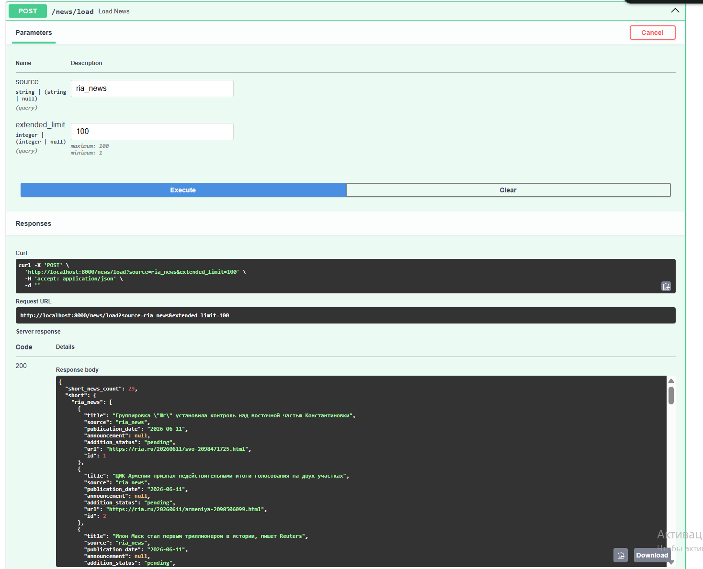
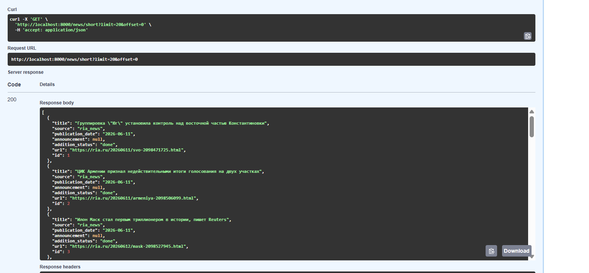
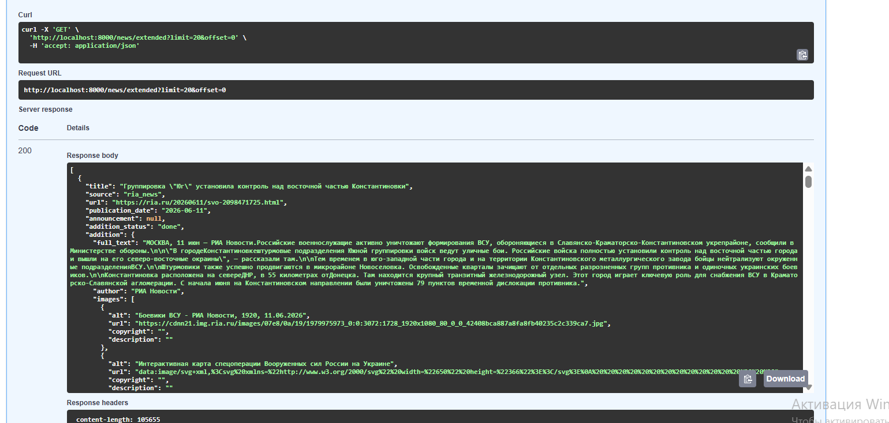

Цель тестового: сделать парсер + апи для риа новости (масштабируемый под другие сервисы)

Как запустить проект? 

1) docker compose up -d --build
2) docker exec news_api uv run alembic upgrade head

Пояснения по проекту:
API написан с помощью FastAPI, для хранения данных используется PostgreSQL. Также для работы с бд используются миграции Alembic и ORM SQLAlchemy для написания простых запросов в бд. Программа построена по паттерну routers -> services -> repositories, для валидации внешних данных используются Pydantic схемы. Процесс парсинга на данный момент вынесен в ручку /news/load, при расширении программы до production варианта требуется вынести парсинг в бекграунд задачи Celery (в рамках тестового не реализовано), получение данных по новостям реализовано через ручки GET /news/extended, GET /news/short для получения расширенной инфо по новостям и краткой инфо по новостям. Архитектура парсинга выстроена таким образом, что при необходимости можно добавить новые парсеры и изменить паттерн парсинга в существюущих, также процес загрузки информации вынесен в отдельный модуль. В рамках тестового парсинг реализован не оптимальным образом, при необходимости довести программу до production варианта стоит внести изменения в асинхронных вызовах лоадера и парсера (лучше использовать TaskGroup) для того, чтобы снизить время ожидания на парсинг данных.

Пример работы программы: 

